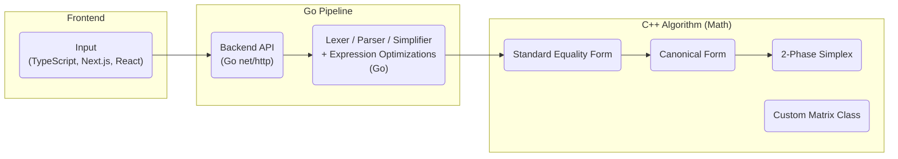

### Simplex Algorithm
A linear programming solver (e.g., cost minimization) built from scratch using the Simplex method.

---

#### Overview:
Take text-based inputs in the form:
```
let x1;
let x2;
max 3 * x1 + 4 * x2;
s.t. x1 + x2 <= 5;
x1 >= 0;
x2 >= 0;
```
and receive optimal solutions (or determine infeasibility/unboundedness).
<p align="left">
  
</p>

---

#### How it works:

